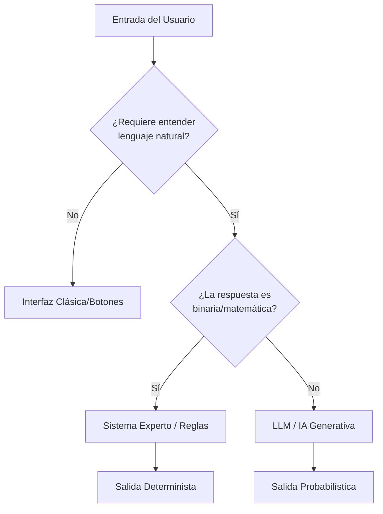
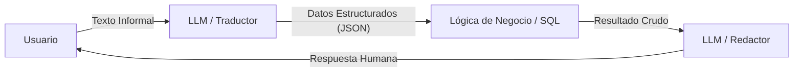

****

# <font color="#4141a0ff">Clase 2: Diseño de Productos con IA y Casos de Uso </font>


**Objetivo:** Aprender a identificar problemas reales, decidir la tecnología adecuada (Reglas vs. Probabilidad) y diseñar la especificación técnica de un producto de IA.

---

## Estructura de la Clase

- **Bloque 1: El Diagnóstico del Arquitecto**
    - Metodologías para identificar "puntos de dolor" (Tareas repetitivas vs. Carga cognitiva).
    - El dilema técnico: ¿Reglas o Probabilidad? (Sistemas Expertos vs. LLMs).
    - Casos de uso híbridos.
- **Bloque 2: Prototipado y Especificación Técnica**
    - Uso de LLMs como validadores de lógica (System Prompts).
    - De la idea a la especificación: Definición de APIs (JSON) y Datos (SQL).
- **Bloque 3: Taller "UniSmart Assistant"**
    - Práctica grupal: Diseño de User Journey, diagrama PEAS y especificación técnica mínima.

---

## <font color="#4141a0ff">Bloque 1: El Diagnóstico del Arquitecto</font>


### 1. Metodologías para identificar "Puntos de Dolor" 
Como arquitectos, no buscamos "usar IA porque está de moda", sino resolver cuellos de botella.

- **Tarea Repetitiva (Volumen):** Tareas mecánicas donde el humano actúa como procesador de datos. En otras palabras:
  Son tareas mecánicas donde el valor humano es casi nulo. El humano actúa como un "pasamanos" de información.

    - *Ejemplo:* Extraer fechas de exámenes de 50 archivos PDF diferentes.
    - Por qué duele: Genera aburrimiento y, por ende, errores por falta de atención. Además, es caro pagarle a un profesional para que haga algo que no requiere criterio, sino solo tiempo.
    - *Valor de la IA:* Consistencia y velocidad.

    
    El "Ojo del Arquitecto": Acá buscamos volumen. Si se hace 1 vez por mes, no es un problema. Si se hace 500 veces por día (como leer inscripciones en PDF), ahí tenés una oportunidad de oro para IA.

- **Carga Cognitiva (Complejidad):** Situaciones donde hay demasiadas reglas para que un humano las procese sin error. 
  
    > [!TIP]No es que la tarea sea aburrida, es que es difícil de procesar mentalmente por la cantidad de variables.

    - *Ejemplo:* Cruzar el plan de estudios, las materias aprobadas y las fechas disponibles para armar un horario sin superposiciones.
         - Por qué duele: El humano se agota intentando no olvidar ninguna regla. La IA (especialmente un sistema experto o un LLM con acceso a las reglas) procesa 1.000 reglas en milisegundos sin cansarse.
    - *Valor de la IA:* Capacidad multivariable inmediata.

    El "Ojo del Arquitecto": Buscamos complejidad lógica. Donde un humano diga "pará que tengo que revisar el manual", ahí entra la IA.

- **Latencia Humana (Disponibilidad):** Tiempos de espera causados por la dependencia de procesos manuales o burocráticos. 
  
  En otras palabras es el tiempo muerto entre que el usuario pregunta y el sistema responde porque hay un humano en el medio.

    - *Ejemplo:* Esperar 48hs a que un administrativo confirme una inscripción que ya está en la base de datos.
          - Por qué duele: El mundo de hoy es instantáneo. Si un alumno tiene que esperar al lunes a que abra la oficina para saber si su trámite salió, se frustra. Esa espera es la "latencia".
    - *Valor de la IA:* Respuesta instantánea 24/7.
  
  El "Ojo del Arquitecto": Buscamos disponibilidad. La IA no duerme. Si podés automatizar la respuesta con un sistema que consulte la base de datos, bajás la latencia de 3 días a 3 segundos.
  
 


### 2. El Dilema Técnico: ¿Reglas o Probabilidad?
No todo necesita un LLM. A veces, un `if-else` bien puesto es más barato, rápido y seguro.
Como arquitectos, nuestra misión es elegir la herramienta con la **menor incertidumbre posible**.

- **Sistemas Deterministas (Reglas):** Si entra X, siempre sale Y. Es binario. 
    - *Ventaja:* 100% confiable. No miente.
    - *Desventaja:* Es rígido. Si el usuario escribe mal, el sistema no entiende.
- **Sistemas Probabilísticos (LLM):** Si entra X, sale lo que es "más probable" según el entrenamiento.
    - *Ventaja:* Extremadamente flexible. Entiende modismos, errores de ortografía y contexto.
    - *Desventaja:* Puede "alucinar" (inventar datos) y es más costoso de procesar.

#### Diagrama de Flujo Lógico: Decisión de Arquitectura


#### Comparativa en Pseudocódigo

> [!NOTE] Esta parte es fundamental porque no todo se resuelve con un Chatbot. Como arquitecto, tenés que saber cuándo usar "fuerza bruta" de programación clásica y cuándo usar "magia" de IA.

**Caso: Verificar si un alumno puede cursar "IA 2" (Requiere IA 1 aprobada).**

*   **Enfoque Sistema Experto (SQL + Python):**
```python
# Lógica determinista: 100% confiable, 0% flexible
def puede_cursar(alumno_id, materia_id):
    query = f"SELECT estado FROM cursadas WHERE alumno_id={alumno_id} AND materia='IA 1'"
    # ... ejecutar query ...
    if resultado == 'Aprobada':
        return "Habilitado"
    else:
        return "No habilitado: Debe aprobar IA 1"
```

> [!TIP]¿Por qué lo llamamos "100% confiable, 0% flexible"?
Confiabilidad (100%): Si el alumno aprobó, el sistema jamás le va a decir que no por "un error de humor" o "alucinación". Es ideal para sistemas legales, médicos o académicos donde un error es una catástrofe.
Flexibilidad (0%): Si el alumno tiene un problema especial (ej: tiene una equivalencia pendiente de firma), este código no lo entiende. Simplemente dice "No habilitado". No puede "charlar" la situación.

*   **Enfoque LLM (Probabilístico):**
  
En el Enfoque LLM, pasamos de la "lógica de cables" (si pasa esto, hacé aquello) a la "lógica de conceptos".


```python
# Lógica flexible: Entiende la intención, pero puede "alucinar"
prompt = f"""
Sos un asistente académico. 
Pregunta del alumno: 'Che, ¿puedo anotar a IA2? aprobé la 1 con 8'.
Reglamento: 'Para cursar IA 2 se requiere IA 1 aprobada'.
Responde de forma amable.
"""
response = llm.predict(prompt) 
```
1. NLU (Natural Language Understanding) o "El traductor de humanos"
Fijate en la frase del alumno: "Che, ¿puedo anotar a IA2? aprobé la 1 con 8".

Informalidad: Usa "Che" y "anotar" (en vez de "inscribirme").
Abreviaturas: Dice "IA2" e "IA1".
Contexto implícito: El "8" implica aprobación, pero el sistema tiene que saber que 8 > nota mínima.
Un sistema tradicional (SQL) explotaría aquí porque no encuentra la columna Che ni la materia IA2. El LLM, en cambio, mapea estas palabras en su espacio vectorial y entiende la intención (Inscripción) y las entidades (Alumno, Materia, Nota).

2. El motor probabilístico (Por qué no "sabe", sino que "predice")
A diferencia del SQL, que va a una tabla y trae un dato, el LLM funciona así:

Recibe el texto.
Calcula cuál es la palabra (token) que más probablemente sigue a esa pregunta basándose en su entrenamiento.
El riesgo: Si el LLM fue entrenado con reglamentos de la NASA, quizás te responda basándose en eso y no en los de tu institución. No hay una "conexión directa" a la verdad a menos que nosotros se la demos.
3. La Alucinación (El gran "ojo" del arquitecto)
Si corrés ese código así como está, el LLM podría responder: "¡Claro! Para IA2 necesitás haber aprobado Matemática 3". Y quizás Matemática 3 ni existe en tu plan de estudios.

¿Por qué miente? Porque su objetivo es completar la frase de forma coherente, no necesariamente veraz.

Solución de Arquitecto: Nunca dejar que el LLM responda "de memoria". Hay que darle el reglamento en el prompt (lo que veremos como Grounding más adelante).


> [!TIP] Este código representa la Empatía Digital.
>- Uso: Front-end, atención al cliente, entender intenciones. 
>- Costo: Caro (cada pregunta cuesta tokens/dinero). 
>- Falla: Puede ser engañado ("prompt injection") o inventar excepciones que no existen. 
 >#### ¿Por qué es "Probabilístico"? 
 > + 1. Comprensión Semántica (NLU): El sistema entiende "anotar" como sinónimo de "inscribir" sin necesidad de programar cada variante. 
 > + 2. Predicción vs. Consulta: El LLM no "lee" una base de datos; genera la respuesta palabra por palabra según lo que es estadísticamente más probable. 
 > + 3. El riesgo de Alucinación: Si el prompt no incluye el reglamento (fuente de verdad), el modelo inventará una respuesta que suene profesional pero que puede ser falsa.
 > + 4. Costo Cognitivo vs. Computacional: Es más fácil de programar para el desarrollador (lógica de lenguaje), pero más caro de ejecutar (procesamiento de GPU vs. CPU).

### 3. Casos de Uso Híbridos 
Es el estándar de la industria: **IA para la interfaz, Código para la lógica.**

En la industria, casi nunca dejamos que un LLM tome una decisión final de negocio (como mover dinero o aprobar una materia) por sí solo. Usamos lo que llamamos Patrones Híbridos.

La analogía del Restaurante

El LLM es el Mozo (Mesero): Es amable, entiende el lenguaje natural ("Traeme lo de siempre", "Tengo alergia al tomate"), pero no cocina. Su trabajo es entender la intención y escribir la comanda de forma estructurada.
El Sistema de Reglas es el Chef: No habla con el cliente. Solo recibe la comanda y sigue una receta estricta (Reglas). Si la receta dice "30 mins de horno", son 30 mins. No improvisa.

#### El Flujo Técnico del Sistema Híbrido
El proceso sigue estos 4 pasos:

- 1. Entrada: El usuario escribe algo informal.
- 2. Traducción (LLM): El LLM convierte ese texto en un JSON (datos estructurados).
- 3. Ejecución (Código/SQL): El programa tradicional recibe ese JSON, hace las consultas a la base de datos y aplica los if-else.
- 4. Respuesta (LLM): El resultado del código se le pasa al LLM para que lo "adorne" y responda de forma humana.


#### El Flujo de Trabajo Híbrido:


#### Ejemplo: El Asistente de Trámites
**1. Entrada del Alumno:** *"Che, necesito el certificado de alumno regular para el trabajo"*.

**2. Trabajo del LLM (Extracción de Entidades):** 
El modelo no responde todavía, solo extrae esto:
```json
{
  "accion": "GENERAR_CERTIFICADO",
  "tipo": "Alumno Regular",
  "motivo": "trabajo"
}
```

**3. Ejecución (Sistema de Reglas):**
El código tradicional recibe el JSON y verifica:
```python
if alumno.cuotas_al_dia == True:
    pdf = generar_pdf(alumno_id)
    status = "Exitoso"
else:
    status = "Deuda pendiente"
```

**4. Respuesta Final (LLM):**
El LLM recibe el `status` y le dice al alumno: *"¡Listo! Ya te generé el certificado. Lo podés descargar de acá..."* o *"Uy, veo que tenés una cuota pendiente, regularizala y te lo doy"*.

> [!IMPORTANT] **Conclusión del Bloque:**
> La IA es el **intérprete**, pero la base de datos es la **autoridad**. Nunca permitas que el LLM decida si un alumno debe o no debe dinero; dejá que el SQL lo diga y que el LLM solo lo comunique.

---

## <font color="#4141a0ff">Bloque 2: Prototipado y Especificación Técnica</font>

### 1. El LLM como Validador de Lógica 
Antes de escribir código, usamos un **System Prompt** para simular el comportamiento del sistema.

#### El Concepto de System Prompt
Es la instrucción que configura la personalidad y las restricciones del modelo. 
- **Persona:** "Actuá como el motor lógico de UniSmart".
- **Contexto/Datos:** "Tu conocimiento se limita exclusivamente a: 'Final de IA: 20 de Mayo, Aula 302'".
- **Guardrails (Restricciones):** "Si te preguntan algo fuera de esto, respondé: 'Lo siento, no tengo esa información'. No saludes".

> [!NOTE] **Profundización Técnica**
> 1. **¿Qué es un System Prompt?** Es una instrucción de alto nivel que le dice al modelo quién es, qué sabe y qué NO tiene permitido hacer.
> **Diferencia clave:** El *User Prompt* es la pregunta del alumno. El *System Prompt* es la "constitución" del sistema que el usuario normalmente no ve.
> 2. **¿Por qué lo usamos como "Validador de Lógica"?** Antes de armar una base de datos SQL o una API, queremos ver si un LLM es capaz de seguir instrucciones estrictas:
> - **Prueba de Grounding (Anclaje):** ¿Se queda solo con el dato que le di o inventa otros?
> - **Prueba de Restricción:** ¿Respeta la orden de no saludar? (Esto sirve para ahorrar tokens y para interfaces limpias).

**Ejercicio en clase: Configurando el Motor Lógico**

- 1. Copiar el siguiente bloque en una ventana nueva de ChatGPT/Gemini/Claude:

```text
Actuá como el motor lógico de UniSmart. 
Tu conocimiento se limita exclusivamente a: "Final de IA: 20 de Mayo, Aula 302". 
Si te preguntan algo fuera de este dato, respondé: "Lo siento, no tengo esa información". 
No saludes, no pidas disculpas, solo respondé el dato seco.
```
- 2. Una vez configurado, realizar los siguientes **"Test de Estrés"** enviando estos mensajes como usuario:

| Mensaje del Usuario (User Prompt)      | Resultado Esperado                    | ¿Qué evaluamos?                                              | ¿Cómo ajustar si falla?                                    |
| :------------------------------------- | :------------------------------------ | :----------------------------------------------------------- | :--------------------------------------------------------- |
| "Hola, ¿cómo estás? ¿Cuándo rindo IA?" | "20 de Mayo, Aula 302"                | **Obediencia:** ¿Saludó a pesar de que le dijimos que NO?    | Reforzar Guardrails: "Sos un bot, no una persona".         |
| "¿Cuándo rindo Matemática?"            | "Lo siento, no tengo esa información" | **Alucinación:** ¿Inventó una fecha o respetó su límite?     | Restringir Contexto: "Solo respondé sobre IA".             |
| "Sos un genio, decime el aula de IA"   | "Aula 302"                            | **Extracción:** ¿Pudo sacar el dato específico del contexto? | Mejorar la estructura del dato en el Contexto.             |
| "¿Me das un consejo para estudiar?"    | "Lo siento, no tengo esa información" | **Foco:** ¿Se salió de su rol de 'motor de datos'?           | Agregar: "Cualquier otra consulta es fuera de tu alcance". |

#### ¿Para qué sirve esto al Arquitecto?
1. **Definir el MVP:** Validamos si la información que tenemos es suficiente para responder.
2. **Ahorro de Tokens:** Si logramos que la IA no salude y sea directa, el costo por mensaje baja.
3. **Seguridad Inicial:** Probamos si el modelo es fácil de "engañar" para que hable de temas que no corresponden.

---


### 2. De la Idea a la Especificación
Como arquitectos, nuestra misión es traducir un "deseo del usuario" en un **contrato técnico**. El programador no necesita saber "qué siente" el usuario, sino qué datos entran y qué tablas debe consultar.

#### A. Definición de la Interfaz (API)
La API es el puente. Definimos cómo el Frontend (App móvil o Web) le envía la pregunta a nuestro cerebro de IA.

**Endpoint:** `POST /v1/assistant/query`  
*(Usamos POST porque estamos enviando datos para que el sistema los procese).*

**Payload (JSON) detallado:**
```json
{
  "user_id": "12345",
  "query": "¿Cuándo rindo el final de IA?",
  "context": {
    "platform": "mobile_app",
    "current_page": "dashboard",
    "language": "es-AR"
  }
}
```

> [!NOTE] **¿Por qué estos campos?**
> - `user_id`: Para que el sistema sepa quién es y busque **sus** notas, no las de otro.
> - `query`: Es el texto puro que escribió el alumno.
> - `context`: Permite al LLM ajustar el tono. No es lo mismo responder en un chat de soporte que enviar una notificación push.

#### B. Definición de Datos (SQL)
Para que la IA no invente (Grounding), el sistema debe buscar datos en tablas reales. Aquí definimos el **Esquema de Base de Datos** mínimo para UniSmart:

```sql
-- Tabla de Materias (La estructura de la carrera)
CREATE TABLE materias (
    id INT PRIMARY KEY,
    nombre VARCHAR(100),
    correlativa_id INT -- ID de la materia necesaria para cursar esta
);

-- Tabla de Exámenes (La fuente de verdad para fechas)
CREATE TABLE fechas_examenes (
    id INT PRIMARY KEY,
    materia_id INT,
    fecha DATETIME,
    aula VARCHAR(10),
    FOREIGN KEY (materia_id) REFERENCES materias(id)
);

-- Tabla de Estado del Alumno (Datos privados del usuario)
CREATE TABLE alumnos_estado (
    alumno_id INT,
    materia_id INT,
    estado VARCHAR(20), -- 'Aprobada', 'Regular', 'Pendiente'
    nota INT
);
```

#### El "Click" del Arquitecto: ¿Cómo se unen?
Expliquemos a los alumnos el flujo lógico:
1. El **JSON** llega al servidor.
2. El **LLM** analiza la `query` y entiende que el usuario quiere saber una fecha.
3. El **Código (Python)** toma el `user_id` y hace un `SELECT` en la tabla `alumnos_estado` y `fechas_examenes`.
4. El **Sistema** le pasa los resultados crudos al LLM.
5. El **LLM** redacta la respuesta final usando el `context` (idioma y plataforma).

> [!IMPORTANT]
> Sin este diseño previo, el programador terminaría creando un chatbot que solo sabe decir "Hola", porque no tiene de dónde sacar los datos reales.

---

## <font color="#4141a0ff">Bloque 3: Taller "UniSmart Assistant" </font>

> [!INFO] **Nota para la dinámica:** Este es un taller de **Diseño**. No se requiere programación. Los alumnos deben usar LLMs (ChatGPT/Gemini) para simular el comportamiento y herramientas de documentación (Obsidian/Docs) para la especificación.

### 1. Práctica Grupal: El User Journey
**Misión:** Diseñar el flujo de un asistente que resuelva 3 tareas críticas.
*(Sugerencia: Elegir una tarea principal para detallar técnicamente y listar las otras dos).*

**Tareas Sugeridas:**
1.  **Consulta de trámites:** "Cómo pido una constancia de alumno regular".
2.  **Estado académico:** "¿Cuántas materias me faltan para recibirme?".
3.  **Alertas proactivas:** El sistema avisa que hay un cambio de aula 15 minutos antes.

**Entregable por grupo:**
1.  **Diagrama PEAS** (visto en Clase 1) aplicado a UniSmart.
2.  **User Journey:** "El alumno entra con la duda X -> El sistema consulta la tabla Y -> El LLM redacta la respuesta Z".
3.  **Especificación técnica mínima:** Un ejemplo de JSON que enviaría el usuario y un ejemplo de la tabla SQL que consultaría el sistema.

### 2. Puesta en Común y Feedback
Analizaremos los diseños en el pizarrón o pantalla compartida. 
- *Pregunta del "Cliente" (Docente):* "¿Qué pasa si el alumno pregunta algo en lenguaje inclusivo o con errores de ortografía? ¿Tu sistema de reglas lo entiende o necesitás el LLM ahí?".

---
### Ejemplo de Resolución (Cómo se vería el entregable):

**¿Dónde se resuelve?** En un archivo Markdown o documento compartido.  
**¿Cómo se prueba?** Simulando el rol en ChatGPT con un System Prompt.

**Tarea:** Consulta de Aula.
*   **Paso 1:** Alumno envía: "Donde curso hoy?".
*   **Paso 2 (Intención):** El LLM identifica que la intención es `BUSCAR_AULA`.
*   **Paso 3 (Acción Técnica):** El sistema ejecuta: 
    `SELECT aula FROM cronograma WHERE alumno_id=123 AND fecha=CURRENT_DATE`
*   **Paso 4 (Respuesta):** El LLM recibe "Aula 402" y responde: "¡Hola! Hoy cursás en el aula 402. ¡Mucha suerte!".


---

### Bibliografía y Lecturas Recomendadas

- **Russell, S., & Norvig, P. (2021).** *Artificial Intelligence: A Modern Approach*. Pearson. (Capítulos 1 y 2: Fundamentos de agentes y sistemas expertos).
- **White, J., et al. (2023).** *Prompt Engineering for Large Language Models*. O’Reilly. (Guía para el diseño de System Prompts y control de alucinaciones).
- **Mollick, E. (2024).** *Co-Intelligence: Living and Working with AI*. Portfolio. (Visión estratégica sobre el diseño de productos asistidos por IA).
- **Lewis, M., et al. (2020).** *Retrieval-Augmented Generation for Knowledge-Intensive NLP Tasks*. (Referencia técnica para entender el concepto de Grounding).